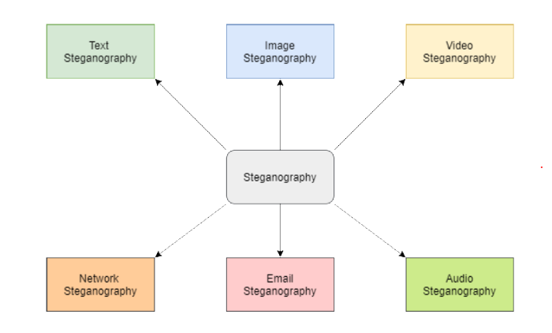

# What is Steganography?
Steganography is the process of hiding a secret message within a large one in such a way that someone can not know the presence or contents of the hidden message.

The purpose of Steganography is to maintain secret communication between two parties. Unlike cryptography, which concels the contents of a secret message, steganography conceals the very fact that a message is communicated.

# Advantage of using Steganography over Cryptography?
Steganography techniques are used increasingly besides cryptography to add more protective layers to the hidden data.

The advantage of using steganography over cryptography alone is that the intended secret message does not attractr attention to itself as an object of scrutiny. Plainly visible encrypted message, not matter how unbreakable they are, arouse interest and may in themselves be incriminating in countries in which encryption is illegal.

# Type of Steganography
Steganography works have been carried out on different transmission media like images, video, text, or audio.

