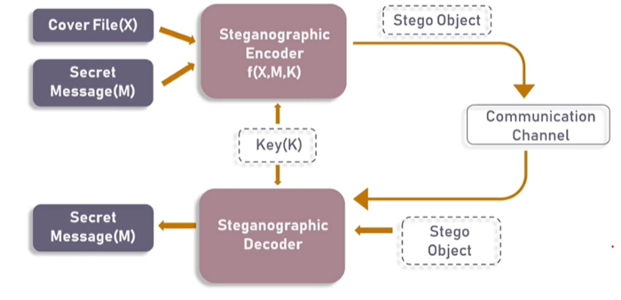

# What is Steganography?
Steganography is the process of hiding a secret message within a large one in such a way that someone can not know the presence or contents of the hidden message.

The purpose of Steganography is to maintain secret communication between two parties. Unlike cryptography, which concels the contents of a secret message, steganography conceals the very fact that a message is communicated.

# Advantage of using Steganography over Cryptography?
Steganography techniques are used increasingly besides cryptography to add more protective layers to the hidden data.

The advantage of using steganography over cryptography alone is that the intended secret message does not attractr attention to itself as an object of scrutiny. Plainly visible encrypted message, not matter how unbreakable they are, arouse interest and may in themselves be incriminating in countries in which encryption is illegal.

# Type of Steganography
Steganography works have been carried out on different transmission media like images, video, text, or audio.

# Basic Steganographic Model

- The original image file(X) and secret message (M) that needs to be hidden are fed into a steganographic encoder as input. 
- Tteganographic Encoder function, f(X,M,K) embeds the secret message into a cover image file by using techniques like least significant bit encoding. 
- The resulting stego image looks very similar to your cover image file, with no visible changes. This completes encoding. 
- To retrieve the secret message, stego object is fed into Steganographic Decoder.

# Least Significant Bit Steganography
- We can describe a digital image as a finite set of digital values, called pixels. 
- Pixels are the smallest individual element of an image, holding values that represent the brightness of a given color at any specific point. So we can think of an image as a matrix (or a two-dimensional array) of pixels which contains a fixed number of rows and columns.
Least Significant Bit (LSB) is a technique in which the last bit of each pixel is modified and replaced with the secret message’s data bit.

